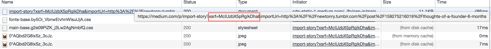

# Migrating blog posts from Tumblr to Medium

I've been blogging using [tumblr](http://newtonry.tumblr.com/) for a quite a while. When I joined [App Academy](https://www.appacademy.io/), they required the students to write a blog post every day. In order to make their standardize things, they mandated that the blog platform of choice be tumblr. After App Academy, I kept using my tumblr account for additional blog posts. Unforuntately, tumblr is not exactly the best blogging platform for technical posts.

I recently concluded I wanted to switch over to Medium(link). The difficulty was that I did not want to lose all my existing content. Medium has a tool to has an [import tool](https://medium.com/@Medium/import-all-the-things-578c8f9016f6) which allows you to migrate a single link or post. Unfortunately, it is only good for one post at a time. I have a total of 81 previous posts, so this was going to be quite a process.

## The process
Hence, I decided to try and automate the migration process as much as possible. There are two steps to it:
- Getting all the existing posts.
- Importing them into Medium.

### Fetching existing posts
Medium's import tool consumes links, so I needed to acquire the links for all my tumblr posts. Luckily they have a [basic api](https://www.tumblr.com/docs/en/api/v1). I used the XML format, which was easy enough to parse with python's `xml.etree.ElementTree`. A common 'issue' with APIs is the limit to the number of items returned per request. However, this is easy enough to solve by [writing a script](tumblr_read.py) that hits the endpoint then paginates until there are no long any results.

### Importing into Medium
Now I had the links. How was I going to import them? It would be a pain to manually copy and paste a link into the Medium UI 81 times. My solution, still somewhat manual, was to open a browser with as many params already filled in. I took the way out and just opened Chrome with `os.system`. Alternative solutions might have been trying to use something like a webdriver to automate the Medium flow. However, that seemed a bit out of scope and manually reviewing the imported posts had value since Medium's import process isn't perfect and sometimes has mistakes or misformatting. You can take a look at that [logic here](medium_import.py).

There were a few limations that I encountered during this part of the process:
- The first was that you needed a XSRF token from Medium. However, this was easy enough to get by looking at the Network tab of the inspector.

- The biggest limitation is that Medium limits you to posting a max of 15 articles a day, hence the entire migration process will take a 6 days for my 81 posts.
- Medium's import is not always 100% accurate, so it's additional work to groom the posts.
- Original publish dates are not included in the imports. They may or may not be relevant to your content.

Anyways, it will be nice to be on a more appropriate blogging platform now. Feel free to try running `convert_posts` yourself!
